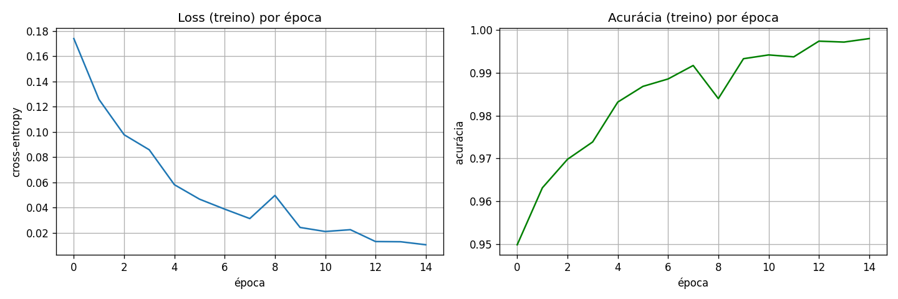
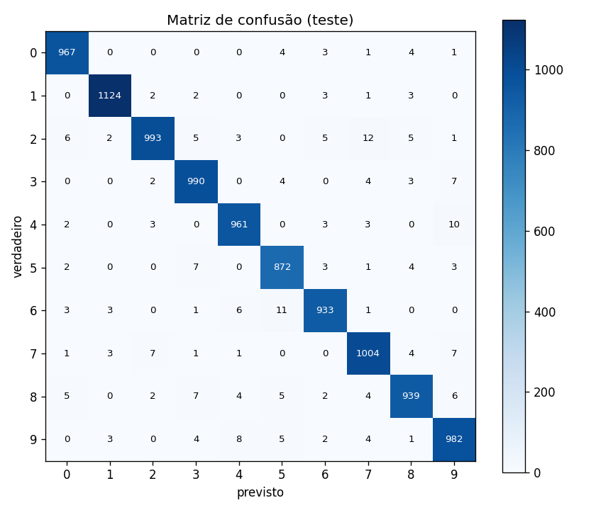
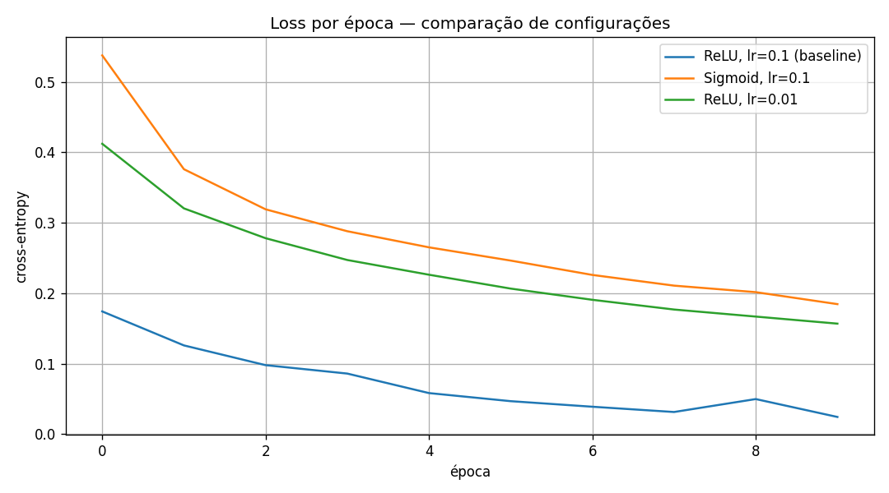

# MLP do Zero — Classificação de Dígitos (MNIST)

Implementação de um **Multi-Layer Perceptron do zero**, usando **apenas NumPy**
para os cálculos (sem PyTorch/TensorFlow/Keras na rede). O `torchvision` é usado
somente para **baixar** o dataset MNIST.

O modelo final atinge **97.65% de acurácia** no conjunto de teste do MNIST
(meta da atividade: ≥ 92%).

---

## Como rodar

```bash
# 1. instalar as dependências
pip install -r requirements.txt

# 2. (opcional) testes unitários das funções de ativação
python -m pytest -v

# 3. (opcional) smoke test: a rede resolve o XOR?  -> deve imprimir [0 1 1 0]
python -m mlp.network

# 4. experimentos completos no MNIST (treino, plots e comparações)
jupyter notebook notebooks/experimentos.ipynb
```

> O notebook baixa o MNIST automaticamente para a pasta `data/` na primeira
> execução e salva os gráficos em `results/`.

---

## Arquitetura escolhida

| Item | Escolha | Por quê |
|---|---|---|
| Camadas | `[784, 128, 64, 10]` (2 ocultas) | mínimo pedido; a 1ª aprende traços simples, a 2ª combina em padrões |
| Ativação (ocultas) | **ReLU** | não satura — o gradiente não "some" ao atravessar as camadas |
| Ativação (saída) | **Softmax** | transforma os 10 scores em probabilidades que somam 1 |
| Loss | **Cross-entropy categórica** | combina com a softmax e dá o gradiente simples `(saída − y)` |
| Inicialização | **He** (`randn * √(2/n_in)`) | mantém a escala dos sinais estável; quebra a simetria entre neurônios |
| Otimizador | **SGD**, learning rate 0.1 | regra básica `param -= lr * grad`, configurável |
| Treino | mini-batches de 64, 15 épocas | estocástico, rápido (~0.6 s/época) |

A implementação é modular (espelha frameworks reais):

```
mlp/
├── activations.py   # sigmoid, relu, softmax + derivadas
├── losses.py        # cross-entropy categórica + gradiente
├── optimizers.py    # SGD
└── network.py       # MLP genérico para N camadas (forward, backprop, fit)
```

A rede é **genérica para qualquer número de camadas**: os pesos ficam em listas
(`self.weights`, `self.biases`) e o forward/backward são loops. Basta mudar
`layer_sizes` para alterar a arquitetura inteira.

---

## Resultados

**Modelo principal** (`[784, 128, 64, 10]`, ReLU, 15 épocas): **97.65%** no teste.

Curvas de treino:



Matriz de confusão (teste):



### Comparação de configurações

Mudando **uma variável por vez** (mesma seed/inicialização, 10 épocas cada):

| Configuração | Acurácia (teste) | Observação |
|---|---|---|
| ReLU, lr=0.1 (baseline) | **0.9779** | melhor resultado |
| Sigmoid, lr=0.1 | 0.9451 | pior — efeito do *vanishing gradient* da sigmoid |
| ReLU, lr=0.01 | 0.9529 | lr baixo converge devagar; não alcança em 10 épocas |



**Leitura:** trocar a ativação de ReLU para sigmoid (mantendo todo o resto)
piora o resultado, porque a derivada da sigmoid é pequena (≤ 0.25) e o gradiente
encolhe ao voltar pelas camadas. Já o learning rate baixo não erra a direção,
só anda devagar demais.

---

## Decisões e dificuldades

**1. Qual foi a decisão técnica mais difícil? Por quê?**

A parte mais difícil foi generalizar a rede. No `testes.ipynb` eu tinha um MLP com
duas camadas fixas (`W1`, `W2`, `b1`, `b2`) escritas na mão, e isso resolvia o XOR.
Mas pro MNIST eu precisava de um número arbitrário de camadas, e não dá pra ir
criando `W3`, `W4`... na mão. A decisão foi guardar os pesos em listas
(`self.weights`, `self.biases`) e transformar o forward e o backward em loops sobre
essas listas. O que mais me embananou foi o índice no backward: lembrar que a
entrada da camada `i` é `a_values[i]` e que, pra propagar o erro pra trás, eu uso a
derivada da ativação em `z_values[i-1]`. Testar no XOR antes do MNIST foi o que me
deu segurança — como deu `[0 1 1 0]`, eu soube que os gradientes estavam certos
antes de escalar.

**2. O que tentei que não funcionou? O que aprendi?**

- Comecei usando **sigmoid** em tudo (era o que eu tinha do XOR). Depois percebi que
  a derivada da sigmoid é no máximo 0.25, então em rede com mais de uma camada o
  gradiente vai encolhendo e some (*vanishing gradient*). Troquei pra **ReLU** nas
  camadas ocultas, e a comparação confirmou na prática: ReLU deu 97.8% contra 94.5%
  da sigmoid na mesma rede.
- Demorei pra entender a diferença entre **loss** e **optimizer** — achava que eram
  a mesma coisa. A ficha caiu quando entendi que a loss só *mede* o erro, e o
  optimizer é quem *usa* o gradiente desse erro pra ajustar os pesos
  (`param -= lr * grad`).
- Tive dois bugs que me custaram tempo. Um foi um parêntese no lugar errado: escrevi
  `categorical_cross_entropy_gradient(y_true, self.a_values[-1] / m)`, dividindo a
  *predição* por `m` em vez de dividir o *gradiente* — isso dá um gradiente errado e
  a rede não treina direito. O outro foi bobo mas travou tudo: digitei `self.foward`
  em vez de `self.forward` e tomei um `AttributeError`. Os dois reforçaram a lição
  de testar no caso pequeno (XOR) antes de rodar o MNIST inteiro.

**3. Se fosse refazer do zero, o que faria diferente?**

- Já começaria com ReLU nas ocultas e softmax na saída, em vez de só sigmoid — agora
  entendo por que essa é a combinação padrão para classificação.
- Escreveria o gradient check numérico logo no início, junto com os testes das
  ativações, pra pegar erro de gradiente na hora em vez de no olho.
- Pensaria a rede como "N camadas em lista" desde o começo, em vez de começar com 2
  camadas fixas e ter que generalizar depois.

---

## Diário de desenvolvimento

*(registro cru, escrito enquanto eu desenvolvia)*

**Dia 01:** Primeiramente eu consegui implementar um perceptron simples na pasta
de testes.

**Dia 02:** Ainda na pasta de testes, para o MLP, eu pedi para o Claude me dar uma
estrutura de código pré-pronta para que eu preenchesse. O esqueleto tinha o
`forward`, o `backward` (com os 5 passos: erro na saída, delta, propagação do erro,
delta da oculta, e atualização dos pesos), o `fit` e o `predict`.

**Dia 03 parte 1:** Agora é só modularizar isso para os arquivos do projeto.
Acabei de perceber que eu havia implementado a sigmoid, mas ela não vai funcionar
bem para o MNIST porque a derivada dela é no máximo 0.25. O Claude já me ajudou me
dando o protótipo da ReLU no `activations.py` para implementar. Depois de uns
vídeos no YouTube eu entendi o que a Softmax faz: pega os resultados da camada de
saída e transforma em probabilidades que somam 1.

**Dia 03 parte 2:** Acabei de implementar o SGD. O conceito de optimizer estava um
pouco confuso, não entendia a diferença com a LOSS. Mas o optimizer é o algoritmo
que calcula o reajuste a partir da métrica LOSS.
